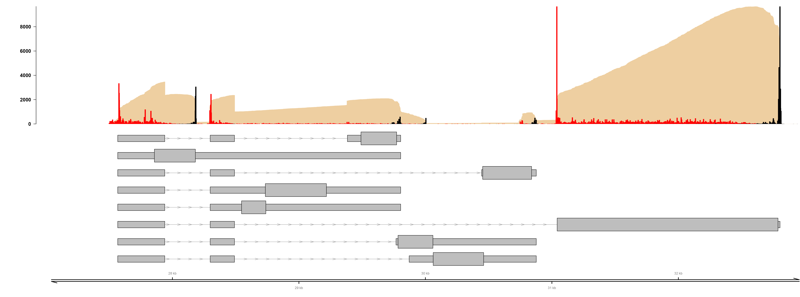

# CurrentProtocols

This page provides basic scripts for the visualization of nanopore direct RNA-Seq (dRNA-Seq) datasets that have been aligned against a viral genome, and is associated with our article (REF) in Current Protocols in Microbiology. 

The script provided is designed to be used in R studio and requires the prior installation of bioconductor modules Gviz and Genomic Features.

The image generated should look as follows:

